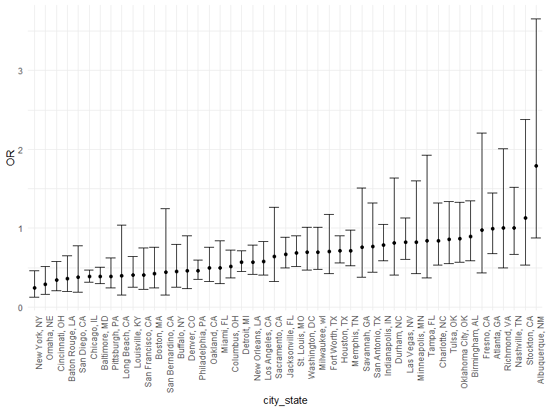

p8105_hw6_sz3213
================
Sitian Zhou
2023-11-18

## Problem 1

``` r
homicide_df <-
  read_csv("data/homicide-data.csv") |> 
  mutate(
    city_state = str_c(city, ", ", state),
    resolved = as.numeric(disposition == "Closed by arrest")
  ) |> 
  filter(city_state != "Tulsa, AL" & victim_race != "Unknown") |> 
  filter(victim_race =="Black" | victim_race == "White") |> 
  mutate(victim_age = as.numeric(victim_age)) |> 
  drop_na()
```

``` r
# fit glm
fit_logistic =
  homicide_df |> 
  filter(city_state == "Baltimore, MD") |> 
  glm(resolved ~ victim_age + victim_sex + victim_race, data = _, family = binomial())

fit_logistic |> 
  broom::tidy() |> 
  mutate(OR = exp(estimate),
         OR_CI_upper = exp(estimate + 1.96 * std.error),
         OR_CI_lower = exp(estimate - 1.96 * std.error)) |>
  filter(term == "victim_sexMale") |> 
  select(OR, OR_CI_lower, OR_CI_upper) |>
  knitr::kable(digits = 3)
```

|    OR | OR_CI_lower | OR_CI_upper |
|------:|------------:|------------:|
| 0.426 |       0.325 |       0.558 |

``` r
# loop over each city
results_df <-
  homicide_df |>
  nest(data = c(resolved, victim_sex), .by = city_state) |> 
  mutate(
    models = map(data, \(df) glm(resolved ~ victim_sex, data = df, family = binomial())),
    results = map(models, broom::tidy)
  ) |> 
  select(-models) |> 
  unnest(results) |> 
  mutate(OR = exp(estimate),
         OR_CI_upper = exp(estimate + 1.96 * std.error),
         OR_CI_lower = exp(estimate - 1.96 * std.error)) |> 
  filter(term == "victim_sexMale") |> 
  select(city_state, OR, OR_CI_lower, OR_CI_upper)

results_df |>
  slice(1:5) |> 
  knitr::kable(digits = 3)
```

| city_state      |    OR | OR_CI_lower | OR_CI_upper |
|:----------------|------:|------------:|------------:|
| Albuquerque, NM | 1.793 |       0.880 |       3.652 |
| Atlanta, GA     | 0.990 |       0.680 |       1.442 |
| Baltimore, MD   | 0.387 |       0.297 |       0.504 |
| Baton Rouge, LA | 0.360 |       0.199 |       0.651 |
| Birmingham, AL  | 0.891 |       0.589 |       1.346 |

``` r
#plots
results_df |> 
  mutate(city_state = fct_reorder(city_state, OR)) |> 
  ggplot(aes(x = city_state, y = OR)) + 
  geom_point() + 
  geom_errorbar(aes(ymin = OR_CI_lower, ymax = OR_CI_upper)) + 
  theme(axis.text.x = element_text(angle = 90, hjust = 1))
```

<!-- -->

## Problem 2

``` r
weather_df = 
  rnoaa::meteo_pull_monitors(
    c("USW00094728"),
    var = c("PRCP", "TMIN", "TMAX"), 
    date_min = "2022-01-01",
    date_max = "2022-12-31") |>
  mutate(
    name = recode(id, USW00094728 = "CentralPark_NY"),
    tmin = tmin / 10,
    tmax = tmax / 10) |>
  select(name, id, everything())
```

``` r
bootstrap_results <-
  weather_df |> 
  modelr::bootstrap(n = 5000) |> 
  mutate(
    models = map(strap, \(df) lm(tmax ~ tmin + prcp, data = df)),
    summary = map(models, broom::glance),
    results = map(models, broom::tidy)) |> 
  select(-models) |> 
  unnest(summary, results) |> 
  select(id = .id, r.squared, term, estimate) |> 
  pivot_wider(
    names_from = term,
    values_from = estimate) |> 
  mutate(
    log_b1b2 = log(tmin * prcp)
  ) |> 
  select(id, r.squared, log_b1b2)
```

``` r
bootstrap_results |> 
  ggplot(aes(x = r.squared)) + geom_density() + 
  labs(title = "Distribution of estimated r square")
```

<!-- -->

``` r
LB_r = bootstrap_results |> pull(r.squared) |>  quantile(0.025)
UB_r =bootstrap_results |> pull(r.squared) |>  quantile(0.975)

c(LB_r, UB_r)|> 
  knitr::kable(digits = 3)
```

|       |     x |
|:------|------:|
| 2.5%  | 0.889 |
| 97.5% | 0.941 |

The distribution of $\hat{r^2}$ is slightly left-skewed, with the range
from 0.86 to 0.96 and the mode around 0.92. The 2.5% and 97.5% quantiles
of the distribution are 0.889 and 0.941, respectively, and the
corresponding 95% confidence interval is (0.889, 0.941).

``` r
bootstrap_results |> 
  filter(log_b1b2 != "NaN") |> 
  ggplot(aes(x = log_b1b2)) + geom_density() +
  labs(title = "Distribution of estimated log(beta1 * beta2)")
```

<!-- -->

``` r
LB_b = bootstrap_results |> filter(log_b1b2 != "NaN") |> pull(log_b1b2) |>  quantile(0.025)
UB_b =bootstrap_results |> filter(log_b1b2 != "NaN") |> pull(log_b1b2) |>  quantile(0.975)

c(LB_b, UB_b)|> 
  knitr::kable(digits = 3)
```

|       |      x |
|:------|-------:|
| 2.5%  | -8.875 |
| 97.5% | -4.586 |

The distribution of $log(\hat{\beta_1} * \hat{\beta_2})$ is heavily
left-skewed, with the range from -12 to -4 and the mode around -5.5. The
2.5% and 97.5% quantiles of the distribution are -8.875 and -4.586,
respectively, and the corresponding 95% confidence interval is (-8.875,
-4.586).

## Problem 3

``` r
bw_df <-
  read_csv("data/birthweight.csv", na = c("", "."))
```
